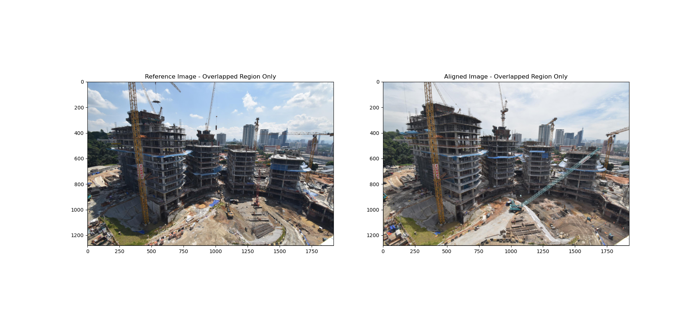
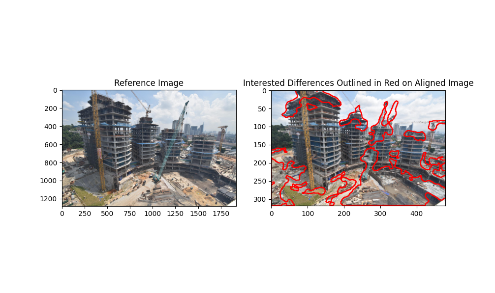
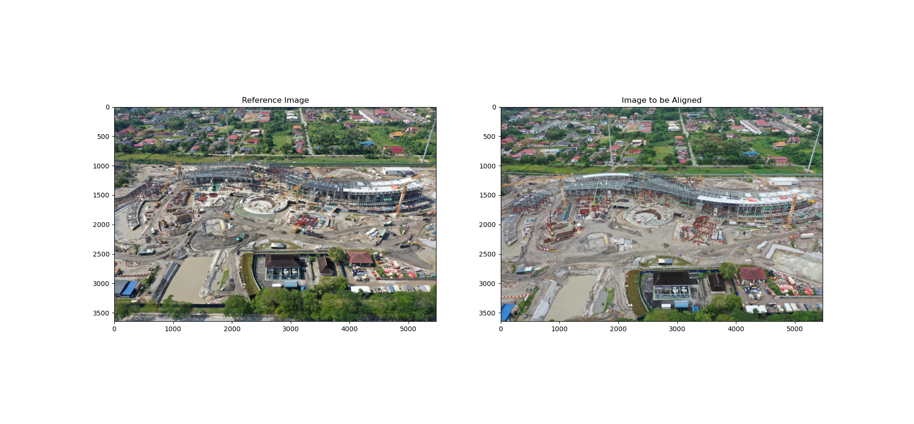
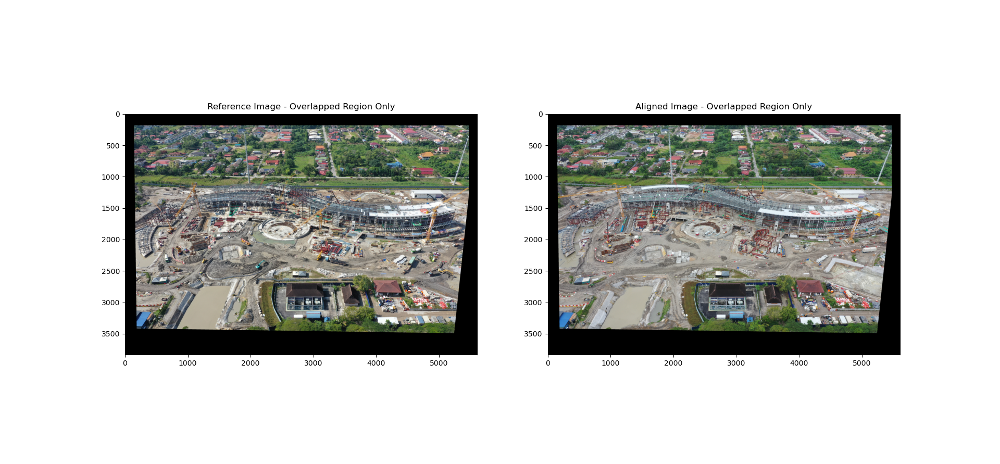

# eGatividhi: Construction Progress Detection System

## Project Overview

This project investigates the feasibility of automating construction site progress monitoring through image processing techniques. Traditional manual observation methods are time-consuming and resource-intensive. Our solution develops advanced image processing algorithms that can determine construction progress by comparing images taken at different stages, significantly reducing monitoring overhead.

This project was further developed as part of eGatividhi, an AI & ML-based Progress Monitoring System for Smart India Hackathon 2024 under the Ministry of Housing and Urban Affairs, reaching finalist status at IIT Gandhinagar.

## Key Features

- Automated alignment of construction site images taken from various angles and resolutions
- Progress detection through image comparison
- Support for different construction stages
- SURF-based feature detection and matching
- SSIM-based structural similarity analysis
- Interactive command-line interface
- Visual output with highlighted changes

## Example Use Cases

### Case 1

#### Input


#### Expected Outputs




### Case 2

#### Input



#### Expected Outputs




## Technical Environment

- Language: Python 3.7
- IDE: Spyder
- Key Libraries: OpenCV-contrib, NumPy, Matplotlib, scikit-image

## Installation Instructions

### 1. Install Anaconda Navigator

Download from: https://www.anaconda.com/products/individual

### 2. Set Up Environment

Open Anaconda Prompt (Windows) or Terminal (MacOS/Linux) and run:

```bash
# Create new environment
conda create --name py37 python=3.7

# Activate environment
conda activate py37

# Install required packages
pip install -U opencv-contrib-python==3.4.2.16
pip install matplotlib
pip install scikit-image
```

### 3. Configure Spyder

1. Open Anaconda Navigator
2. Select "Environments" from sidebar
3. Switch to "py37" environment
4. Return to "Home"
5. Install and launch Spyder

### 4. Run the Program

1. Ensure the Resources folder with SET_B and SET_A dataset images is in the script directory
2. Open the script in Spyder
3. Run the program

## Important Note

The SURF algorithm used in this project was previously patented and has been moved to opencv_contrib. The installation instructions specifically use an older version of opencv_contrib (3.4.2.16) as the algorithm was removed from later versions.

## Technical Implementation Details

### Image Processing Functions

#### ResizeWithAspectRatio

This function resizes images while maintaining their aspect ratio to prevent distortion.

```python
def ResizeWithAspectRatio(image, width=None, height=None, inter=cv2.INTER_AREA)
```

Parameters:

- image: Input image to be resized
- width: Desired width (optional)
- height: Desired height (optional)
- inter: Interpolation method
  Returns: Resized image maintaining aspect ratio

#### stitchImages

Performs image stitching by applying homography transformation and handling overlapping regions.

```python
def stitchImages(img1, img2, H)
```

Parameters:

- img1: Reference image
- img2: Image to be aligned
- H: Homography matrix
  Returns: Stitched image and binary masks for overlapping regions

#### imageAlignment

Handles the complete image alignment process using SURF features.

```python
def imageAlignment(img1, img2, surfHessianThreshold, goodMatchPercent)
```

Parameters:

- img1: Reference image
- img2: Image to be aligned
- surfHessianThreshold: Threshold for SURF detector
- goodMatchPercent: Percentage of good matches to keep
  Returns: Overlapped regions of both images after alignment

#### SSIMandDiff

Calculates structural similarity between aligned images and generates difference maps.

```python
def SSIMandDiff(img1only_overlapped, alignedImg_overlapped, winSize)
```

Parameters:

- img1only_overlapped: Overlapped region of reference image
- alignedImg_overlapped: Overlapped region of aligned image
- winSize: Window size for SSIM calculation
  Returns: SSIM score and difference image

#### processDifferences

Processes detected differences and visualizes changes with contour highlighting.

```python
def processDifferences(img1only_overlapped, alignedImg_overlapped, imageWidth, SSIMimg, resizeFactor, winSize)
```

Parameters:

- img1only_overlapped: Overlapped region of reference image
- alignedImg_overlapped: Overlapped region of aligned image
- imageWidth: Width of the original image
- SSIMimg: SSIM difference image
- resizeFactor: Image resize factor
- winSize: Window size for filtering
  Returns: Image with detected changes highlighted

### Program Flow

The main program follows this sequence:

1. User selects operation mode (Image Alignment or Alignment with Change Detection)
2. User chooses resize options if applicable
3. User selects image set from available options
4. Program loads and processes images
5. Performs feature detection and matching
6. Aligns images using homography transformation
7. Calculates structural similarity if change detection is selected
8. Visualizes results with appropriate overlays and highlights

## Available Image Sets

The system includes two main datasets:

1. SET_B Dataset (Multiple date pairs)

   - 24/07/2020 & 27/08/2020
   - 02/09/2020 & 07/10/2020
   - 25/07/2020 & 14/08/2020
   - 17/08/2020 & 07/09/2020
   - 09/09/2020 & 01/10/2020

2. SET_A Dataset
   - West (30/06/2020 & 10/07/2020)
   - East (17/07/2020 & 24/07/2020)
   - Overall (21/08/2020 & 28/08/2020)
   - Overall (04/09/2020 & 11/09/2020)
   - Overall Front (25/09/2020 & 10/10/2020)

## Project Structure

```
project/
│
├── Resources/
│   ├── Figures/
│   │   └── [Example images]
│   ├── SET_B_*.jpg
│   └── SET_A_*.jpg
│
└── main.py
```

## Acknowledgments

- Developed by Ganesh Kumar
- Finalist project at Smart India Hackathon 2024
- Showcased at IIT Gandhinagar
- Supported by Ministry of Housing and Urban Affairs
